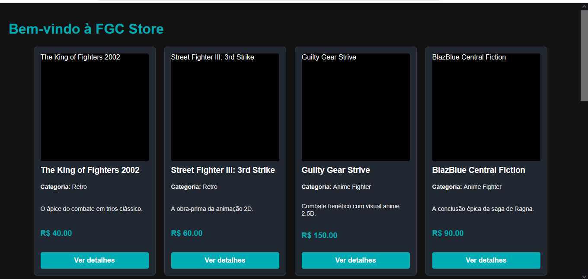
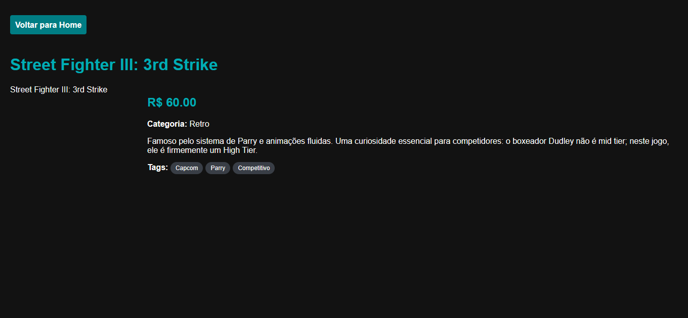
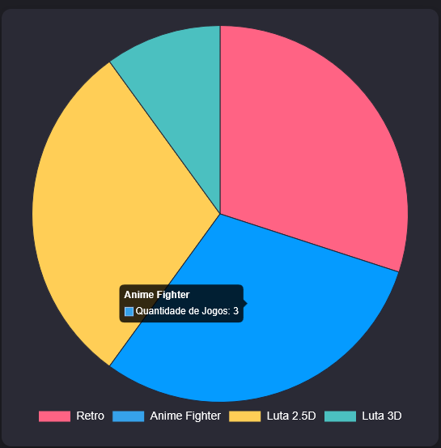
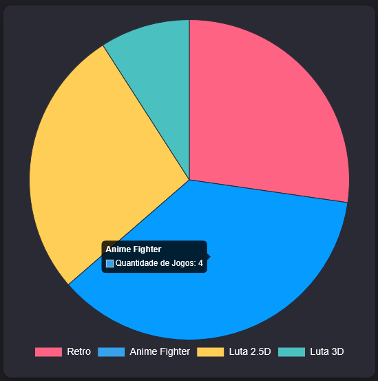

# FGC Store - Catálogo Dinâmico e Dashboard

**Nome:** Miguel F. Abood  
**Disciplina:** Desenvolvimento de Interfaces Web

---

## Sobre o Projeto
Este projeto é uma aplicação front-end que simula uma loja de videogames. Ele consome uma API RESTful local utilizando o **JSON Server** e apresenta os dados de forma dinâmica. O projeto conta com a listagem de jogos (Home), uma página de detalhes gerada dinamicamente via `URLSearchParams` (QueryString) e um painel de dados interativo utilizando a biblioteca **Chart.js**.

---

## Estrutura de Dados (`db.json`)

O banco de dados do projeto possui duas coleções principais:
* **`jogos`**: A coleção principal que abriga os produtos da loja. Cada item contém ID, título, descrições (curta e completa), URL da imagem, categoria, preço e um array de tags.
* **`categorias`**: Coleção de suporte que lista as categorias disponíveis (Retro, Anime Fighter, Luta 2.5D, Luta 3D).

### 💡 Exemplo de um registro da coleção `jogos`:
```json
{
  "id": 2,
  "titulo": "Street Fighter III: 3rd Strike",
  "descricaoCurta": "A obra-prima da animação 2D.",
  "descricaoCompleta": "Famoso pelo sistema de Parry e animações fluidas. Uma curiosidade essencial para competidores: o boxeador Dudley não é mid tier; neste jogo, ele é firmemente um High Tier.",
  "imagem": "[https://upload.wikimedia.org/wikipedia/en/2/2c/SF3_Third_Strike_Arcade_Flyer.jpg](https://upload.wikimedia.org/wikipedia/en/2/2c/SF3_Third_Strike_Arcade_Flyer.jpg)",
  "categoria": "Retro",
  "preco": 60.00,
  "tags": ["Capcom", "Parry", "Competitivo"],
  "destaque": true
}
```
Demonstração da Aplicação

(As imagens abaixo demonstram o funcionamento do consumo da API e a geração do gráfico dinâmico)
### Tela Inicial (Home)


### Página de Detalhes do Jogo


### Dashboard (Chart.js) - Print 1


### Dashboard (Chart.js) - Print 2 (Após alteração no banco)


Tecnologias Utilizadas

    HTML5 & CSS3: Estrutura e estilização das páginas.

    JavaScript (Vanilla): Lógica de requisições assíncronas (Fetch API) e manipulação do DOM.

    JSON Server: Simulação de backend e API RESTful local.

    Chart.js: Biblioteca externa para a renderização do gráfico de pizza (Dashboard).
